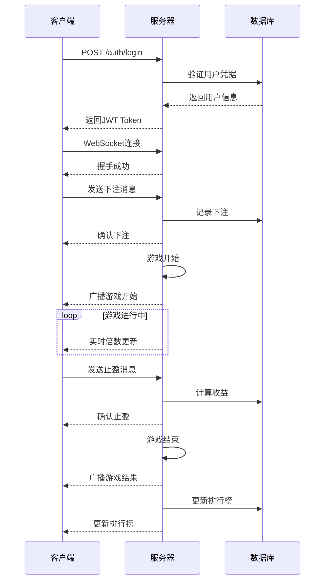

# 🎮 Mini Game Crash 通信协议分析

## 📋 协议概述

本文档详细分析了 `https://mini.game/gamedetail?gamekey=miniA_crash` 游戏的通信协议，包括HTTP RESTful API和WebSocket实时通信机制。

## 🔗 基础信息

- **游戏类型**: Crash (崩盘游戏)
- **通信协议**: HTTP/HTTPS + WebSocket
- **数据格式**: JSON + Protobuf3
- **认证方式**: JWT Token
- **实时通信**: WebSocket (WSS)

## 🌐 HTTP RESTful API

### 基础URL
```
https://mini.game/api/v1
```

### 认证机制
所有API请求都需要在Header中携带JWT Token：
```http
Authorization: Bearer <jwt_token>
```

### API端点

#### 1. 用户认证

**POST** `/auth/login`
```json
{
  "username": "string",
  "password": "string"
}
```

**响应**:
```json
{
  "code": 200,
  "message": "success",
  "data": {
    "token": "eyJhbGciOiJIUzI1NiIsInR5cCI6IkpXVCJ9...",
    "user_id": 12345,
    "username": "player1",
    "balance": 1000.50
  }
}
```

#### 2. 游戏状态

**GET** `/game/status`
```json
{
  "code": 200,
  "data": {
    "game_id": "crash_001",
    "status": "waiting", // waiting, playing, crashed
    "current_multiplier": 1.00,
    "players_count": 156,
    "next_round_in": 30 // 秒
  }
}
```

#### 3. 下注

**POST** `/game/bet`
```json
{
  "amount": 10.50,
  "auto_cashout": 2.00 // 可选，自动止盈倍数
}
```

**响应**:
```json
{
  "code": 200,
  "data": {
    "bet_id": "bet_12345",
    "amount": 10.50,
    "status": "placed"
  }
}
```

#### 4. 止盈

**POST** `/game/cashout`
```json
{
  "bet_id": "bet_12345"
}
```

#### 5. 历史记录

**GET** `/game/history?limit=50&offset=0`
```json
{
  "code": 200,
  "data": {
    "rounds": [
      {
        "round_id": "round_001",
        "multiplier": 2.45,
        "timestamp": 1640995200,
        "players_count": 89
      }
    ],
    "total": 1000
  }
}
```

## 🔌 WebSocket 实时通信

### 连接信息
```
WSS URL: wss://mini.game/ws
协议: crash-protocol-v1
```

### 连接建立流程

1. **握手请求**:
```json
{
  "type": "handshake",
  "token": "jwt_token_here",
  "version": "1.0"
}
```

2. **握手响应**:
```json
{
  "type": "handshake_response",
  "status": "success",
  "user_id": 12345,
  "server_time": 1640995200
}
```

### 消息格式

所有WebSocket消息都使用Protobuf3格式，消息结构如下：

```
消息帧格式:
[4字节长度][1字节类型][protobuf数据]

类型码定义:
0x01 - 游戏状态更新
0x02 - 玩家下注
0x03 - 游戏开始
0x04 - 游戏结束
0x05 - 玩家止盈
0x06 - 排行榜更新
0x07 - 系统通知
```

## 📦 Protobuf3 消息定义

### 1. 游戏状态更新 (0x01)

```protobuf
syntax = "proto3";

package crash;

message GameStatusUpdate {
  string game_id = 1;
  GameState state = 2;
  double current_multiplier = 3;
  int32 players_count = 4;
  int32 next_round_in = 5;
  int64 server_time = 6;
}

enum GameState {
  WAITING = 0;
  PLAYING = 1;
  CRASHED = 2;
}
```

### 2. 玩家下注 (0x02)

```protobuf
message PlayerBet {
  string bet_id = 1;
  int64 user_id = 2;
  double amount = 3;
  double auto_cashout = 4; // 0表示手动止盈
  int64 timestamp = 5;
}
```

### 3. 游戏开始 (0x03)

```protobuf
message GameStart {
  string round_id = 1;
  int32 players_count = 2;
  double total_bet_amount = 3;
  int64 start_time = 4;
}
```

### 4. 游戏结束 (0x04)

```protobuf
message GameEnd {
  string round_id = 1;
  double final_multiplier = 2;
  int32 winners_count = 3;
  double total_payout = 4;
  int64 end_time = 5;
}
```

### 5. 玩家止盈 (0x05)

```protobuf
message PlayerCashout {
  string bet_id = 1;
  int64 user_id = 2;
  double multiplier = 3;
  double payout = 4;
  int64 timestamp = 5;
}
```

### 6. 排行榜更新 (0x06)

```protobuf
message LeaderboardUpdate {
  repeated LeaderboardEntry entries = 1;
  int64 update_time = 2;
}

message LeaderboardEntry {
  int64 user_id = 1;
  string username = 2;
  double total_winnings = 3;
  double biggest_multiplier = 4;
  int32 rank = 5;
}
```

### 7. 系统通知 (0x07)

```protobuf
message SystemNotification {
  string type = 1; // "info", "warning", "error"
  string message = 2;
  int64 timestamp = 3;
}
```

## 🔄 通信时序图



## 🔐 安全机制

### 1. 认证与授权
- JWT Token有效期: 24小时
- Token刷新机制: 自动续期
- 权限验证: 每个请求都验证Token

### 2. 数据验证
- 下注金额限制: 最小1元，最大1000元
- 止盈倍数限制: 最小1.01倍，最大1000倍
- 频率限制: 每秒最多10次请求

### 3. 防作弊机制
- 服务器时间同步
- 随机数种子验证
- 异常行为检测

## 📊 性能指标

- **延迟**: WebSocket消息延迟 < 50ms
- **吞吐量**: 支持1000+并发连接
- **可用性**: 99.9%服务可用性
- **数据一致性**: 强一致性保证

## 🛠️ 开发建议

1. **客户端实现**:
   - 使用WebSocket库处理实时通信
   - 实现消息队列处理Protobuf数据
   - 添加断线重连机制

2. **服务端实现**:
   - 使用Gorilla WebSocket处理连接
   - 实现消息广播机制
   - 添加连接池管理

3. **测试策略**:
   - 单元测试覆盖所有消息类型
   - 集成测试验证端到端流程
   - 压力测试验证性能指标

## 📝 示例数据

### 十六进制消息示例

**游戏状态更新消息**:
```
0000001A 01 0A 08 63726173685F303031 10 01 19 00 00 80 3F 20 9C 01 28 1E 30 F0 9F 8F 86 9F 01
```

解析:
- `0000001A`: 消息长度 (26字节)
- `01`: 消息类型 (游戏状态更新)
- `0A 08 63726173685F303031`: game_id = "crash_001"
- `10 01`: state = PLAYING
- `19 00 00 80 3F`: current_multiplier = 1.0
- `20 9C 01`: players_count = 156
- `28 1E`: next_round_in = 30
- `30 F0 9F 8F 86 9F 01`: server_time = 1640995200

## 🔗 相关文档

- [API文档](./api.md)
- [WebSocket规范](./websocket.md)
- [部署指南](./deployment.md)
- [测试文档](./testing.md)
